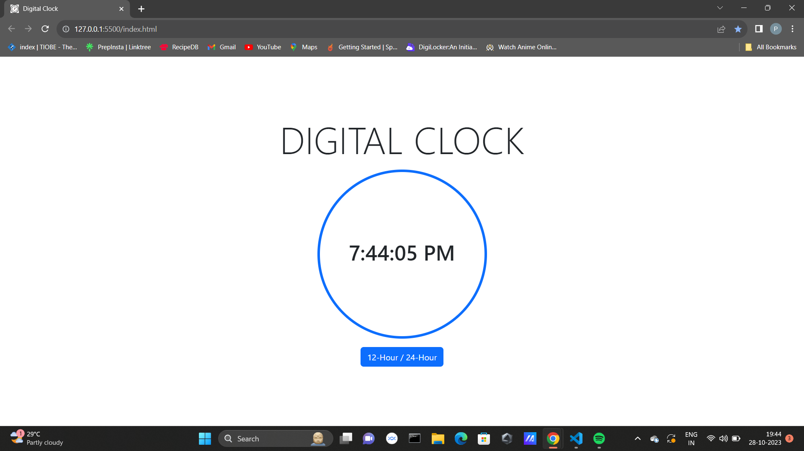

# Digital Clock

## Overview
This is a digital clock web application that displays the current time in both 12-hour and 24-hour formats. It's a simple project built using HTML, CSS, JavaScript and Bootstrap.

## Features
- Real-time display of the current time
- Toggle between 12-hour and 24-hour time formats

## Usage
- Open `index.html` in your web browser to view the digital clock.
- Click the "12-Hour / 24-Hour" button to switch between time formats.

## Technologies Used
- HTML
- CSS
- JavaScript

## Screenshots

## License
This project is licensed under the MIT License - see the [LICENSE](LICENSE) file for details.
